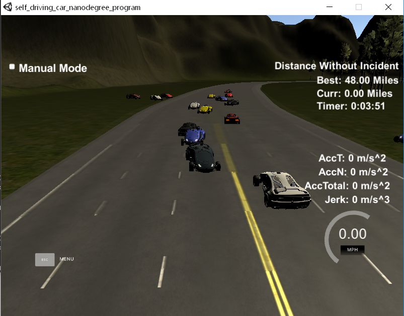

# CarND-Path-Planning-Project
Self-Driving Car Engineer Nanodegree Program


## Goals
In this project your goal is to safely navigate around a virtual highway with other traffic that is driving +-10 MPH of the 50 MPH speed limit. You will be provided the car's localization and sensor fusion data, there is also a sparse map list of waypoints around the highway. The car should try to go as close as possible to the 50 MPH speed limit, which means passing slower traffic when possible, note that other cars will try to change lanes too. The car should avoid hitting other cars at all cost as well as driving inside of the marked road lanes at all times, unless going from one lane to another. The car should be able to make one complete loop around the 6946m highway. Since the car is trying to go 50 MPH, it should take a little over 5 minutes to complete 1 loop. Also the car should not experience total acceleration over 10 m/s^2 and jerk that is greater than 10 m/s^3.


## Basic Build Instructions

1. Clone this repo.
2. Make a build directory: `mkdir build && cd build`
3. Compile: `cmake .. && make`
4. Run it: `./path_planning`.


### Dependencies
* simulator.
  * You can download the Term3 Simulator which contains the Path Planning Project from the [here](https://github.com/udacity/self-driving-car-sim/releases/tag/T3_v1.2).
* cmake >= 3.5
  * All OSes: [click here for installation instructions](https://cmake.org/install/)
* make >= 4.1
  * Linux: make is installed by default on most Linux distros
  * Mac: [install Xcode command line tools to get make](https://developer.apple.com/xcode/features/)
  * Windows: [Click here for installation instructions](http://gnuwin32.sourceforge.net/packages/make.htm)
* gcc/g++ >= 5.4
  * Linux: gcc / g++ is installed by default on most Linux distros
  * Mac: same deal as make - [install Xcode command line tools]((https://developer.apple.com/xcode/features/)
  * Windows: recommend using [MinGW](http://www.mingw.org/)
* [uWebSockets](https://github.com/uWebSockets/uWebSockets)
  * Run either `install-mac.sh` or `install-ubuntu.sh`.
  * If you install from source, checkout to commit `e94b6e1`, i.e.
    ```
    git clone https://github.com/uWebSockets/uWebSockets 
    cd uWebSockets
    git checkout e94b6e1
    ```
## Development diary
2. Implemented car going just straight.
3. Car going in circles, with reuse of previous path.
4. Car following map waypoints. Car teleports 30 m every 0.02 s.
5. Line interpolation between map waypoints + lane can be chosen. Car drive better, but jerky behaviour around waypoints. Seems to be worse in the far right lane, because the the car is far from the original waypoints on the yellow line.
6. Implemented smoothing of custom sparse points via splines. Suddenly, the car drives nicely without exceeding limits for accelaration or jerk. Time to deal with the collision avoidance.
7. When slower car is in front of us, use its speed as reference for our speed.
8. Instead of slowing down, do a left lane change.
9. Think about the logic of the state machine. Decided to use 3 states - left lane change, right lane change and keep in lane with speed adjustments. The calculation splitted into two parts - setting flags and choosing state.
10. Flags based on other vehicle positions.
11. Flags made a little bit more complicated to take into account other vehicles' relative speed and if they are in front of us or behind us.
12. Experimenting with making the distances in flags dependant on relative speed to allow the vehicle to be more aggressive in slow speed/traffic situations.
13. Reverting back to previous version of flags.
14. Since we are only checking adjacents lanes, it is beneficial to be in the center lane to maximize the number of available options. Implemented returning back to center lane.
15. Sometimes, the vehicle cannot decide which lane is better and gets stuck driving between two lanes, violating the rule for quick lane change. Implemented flag for ongoing lane change maneuver, which disables other lane changes until the current maneuver finishes.
16. Some code refactoring.


## Final implementation description

### ```main.cpp``` contains the code.

- ```204-210``` **setting up initial variables**
	- we start in center lane with speed 0 m/s
	- no lane change in progress, start the timer for lane changes
- ```233-245``` **receiving values from simulator**
	- vehicle variables, previous path, sensor fusion data
- ```254``` **remember how many points were unused from the previous path**
- ```256-260``` **vehicle reference position**
	- corresponds to vehicle position on the latest planned position
	- initially setup with the current vehicle position
- ```262-288``` **coarse waypoints and update reference position**
	- declare coarse waypoints, which will be used to generate new trajectory
	- feed the last two points from the previous path to coarse waypoints or use extrapolation into past from current vehicle position
	- in the same time update the vehicle reference position to the last point on previous path 
	
#### Sensor fusion

- ```293-295``` **Declare 3 flags**
	- is something in my lane and are left/right lanes available for lane change
- ```300-360``` **Loop over all detected cars**
	- ```303``` **Another flag for something in the same longitudinal space**
	- ```305-313``` **Calculate vehicle absolute speed and predict its position into future to the time of our reference position**
	- ```317-320``` **Check if there is vehicle in front and set flag accordingly**
	- ```325-328``` **Check and set the longitudinal space flag**
	- ```330-344``` **Left lane available flag**
		- check if we there is even a lane on the left
		- check if there is freespace in the left lane
	- ```348-360``` **Right lane available flag**
		- check if we there is even a lane on the right
		- check if there is freespace in the right lane

#### State machine ```362-414```

1. something is ahead of me in my lane
	1. consider left lane change
	2. consider right lane change
	3. slow down
2. my lane is free
	1. consider lane change to center
	2. speed up to allowed limit

Anytime lane change is initiated, set the lane change in progress flag and reset counter. Until the counter reaches some value and resets the flag, no lane change is allowed.

#### Calculate new trajectory to take

- ```418-434``` **Finish coarse waypoints**
	- using the new picked lane, add 3 points to the 2 points from the previous path
	- transform them into local vehicle coordinates
- ```437-438``` **Fit a spline through the coarse waypoints**
- ```440-449``` **Initiate the new trajectory waypoints**
	- add to it the remaining points from the previous path
- ```451-475``` **Add new waypoints to the trajectory**
	- evaluate the spline at points corresponing to the requested speed
	- transform back to global coordinates
	- repeat until we have 50 waypoint ready in the new trajectory

#### Debug
- ```477-482``` **Debug**
	- show the flag values
	- Is there something blocking us in our lane?
	- Is there something blocking left lane?
	- Is there something blocking right lane?
	- Is currently lane change maneuver being executed?
	
#### ```484-490``` **Send the new trajectory to the simulator**

## Result and discusssion

- the car is able to drive quite reliably around the track
- record is 48 miles without incident

- the car stays in its lane apart from the lane changes
- the limits for speed, acceleration and jerk are not exceed
- the incidents are dozens of miles apart, some automated incident recording would be necesarry to debug the fails
- in my opinion, the corner cases will be dense traffic with big speed differences.


## Ideas for improvements

- deal with the oscillating character of the slowing down behind a vehicle
- consider not only adjacent lanes
- make the safe distances in flag claculations dependant on relative speed. We could navigate slow traffic more fluently.
- more advanced path generation: cost minimizing scheme on pool of candidate trajectories


## Acknowledgement

This project uses spline fucntion by http://kluge.in-chemnitz.de/opensource/spline/.

